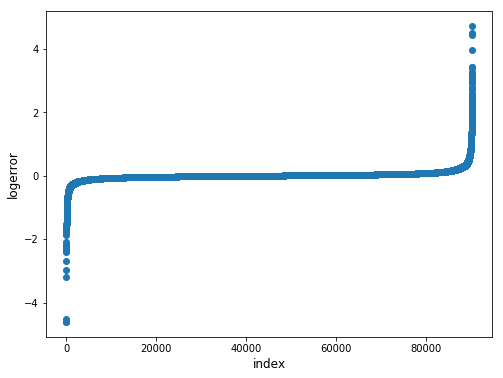
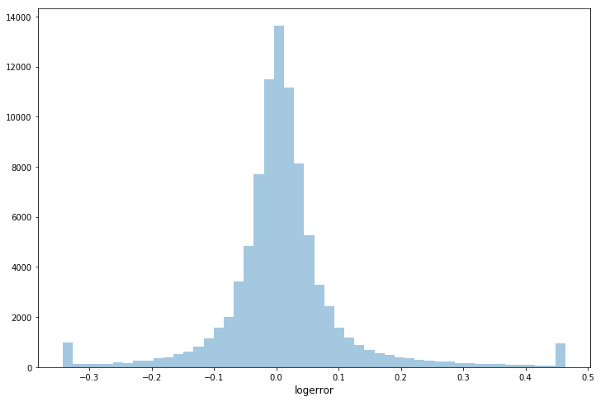

### __Data cleaning__ means filtering and modifying your data such that it is easier to explore, understand, and model. Filtering out the parts you don't want or need so that you don't need to look at or process them. Modifying the parts you do need but aren't in the format you need them to be in so that you can properly use them.

### Missing data

#### handling missing data in pandas
 - __Check for NANs:__ `pd.isnull(object)` Detect missing values in your data; this detects both “NaN” and “None”  
 - __Drop missing data:__ `df.dropna(axis=0, how='any')` Returns your data frame where any data points containing NaNs have been removed.  
 - __Replace missing data:__ `df.replace(to_replace=None, value=None)` Replace values given in "to_replace" with "value". This is useful if you know some value that you'd like this feature variable to be.  
 - __Drop a feature:__ `df.drop('feature_variable_name', axis=1)` If you find that a certain feature variables has > 90% of NaN values in the dataset, it makes sense to just drop the whole thing from your data.

### Outliers
It is good practice to look at the data from both sides.  Explore both with and without the outliers.

#### Get the 98th and 2nd percentile as the limits of our outliers
`upper_limit = np.percentile(df.logerror.values, 98)` 
`lower_limit = np.percentile(df.logerror.values, 2) `
#### Filter the outliers from the dataframe
`data['target'].loc[df['target'] > upper_limit] = upper_limit data['target'].loc[df['target'] < lower_limit] = lower_limit`

A plot with outliers included (left) and a histogram with outliers removed (right)
  data with outliers  |   data without outliers
  ------------------- | ---------------------
    | 

### Bad data and duplicates
Examining the data in pandas for obvious errors can be done using `.unique`. Examining fields like year and gender that have expected unique values will help in identifying data that is errored. For example, a year of 5015 is most likely intended to be 2015. Or a numeric value in a gender field populated with M/F indicates a record(s) that need to be corrected.

Example: If some gender records contain a '1' instead of an 'male' they could be replaced in pandas like this:

`value_map = {'male': 'male', 'female': 'female', '1': 'male'}`
`pd_dataframe['gender'].map(value_map)`

__Duplicates__ are simply data points which are exactly repeated in your dataset. Duplicates can simply be dropped from your data as we saw above.
Identifying duplicates and be as easy as doing a `.count` on items with in the dataset.

### Remove irrelevant features
Many datasets include irrelevant fields that can be removed like so:

`df.drop('feature_variable_name', axis=1)`

### Standardization

It is important that all the data in a feature variable be in the same standardised formta.  For example, let's take the example of the "gender" variable again with values "male" or "female". If the data was collected by a human you might get many different values which you did not expect:

 - male, female (this one's good)  
 - MALE, FEMALE (entered with caps lock on)  
 - Male, Female (some people will capitalise)  
 - Make, Femall (typos!)

If it's something simple that making something all lower case or capitalising the first letter, just do something like this:

__Make the whole string lower case__  
`s.lower()`  
__Make the first letter capitalised__  
`s.capitalize()`  

If there are typos then you'll want to use the mapping function that we saw before:

`value_map = {'Make': 'male', 'Femall': 'female'}  `
`pd_dataframe['gender'].map(value_map)  `
